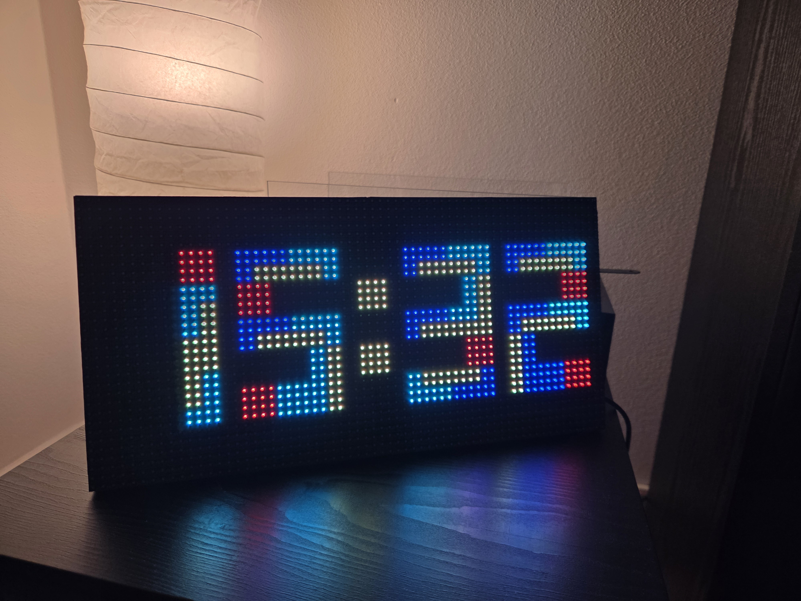

# Tetris Clock

A Raspberry Pi-powered clock that displays time using falling Tetris blocks on a 64x32 LED matrix.



Recreates the popular Arduino [TetrisAnimation](https://github.com/toblum/TetrisAnimation) library to run on Raspberry Pi using [rpi-rgb-led-matrix](https://github.com/hzeller/rpi-rgb-led-matrix).

## Hardware

- **SBC:** Raspberry Pi Zero W
- **Display:** 64x32 HUB-75D LED Matrix
- **HAT:** Adafruit RGB Matrix Bonnet for Raspberry Pi
- **Power:** 5V/3A power supply

## Setup

### 1. Prepare the Raspberry Pi

Flash **Raspberry Pi OS 32-bit** (Lite is sufficient) to an SD card. Enable SSH and configure WiFi during setup.

### 2. Connect the hardware

1. Attach the Adafruit RGB Matrix Bonnet to the Pi's GPIO header
2. Connect the HUB-75 ribbon cable from the bonnet to the LED matrix
3. Connect the 5V/3A power supply to the bonnet's power terminal

### 3. Clone the project

```bash
ssh pi@<your-pi-ip>
git clone <your-repo-url> ~/tetris-clock
cd ~/tetris-clock
```

### 4. Run the installer

```bash
sudo bash install.sh
```

This will:
- Install system dependencies (`python3-dev`, `python3-pillow`, `git`)
- Clone and build the [rpi-rgb-led-matrix](https://github.com/hzeller/rpi-rgb-led-matrix) Python bindings
- Disable onboard audio and Bluetooth in `/boot/config.txt` (required -- audio's PWM conflicts with the LED matrix driver)
- Install and enable the systemd service for auto-start on boot

### 5. Reboot

```bash
sudo reboot
```

The clock will start automatically after reboot.

## Usage

### Manual control

```bash
# Start
sudo systemctl start tetris-clock

# Stop
sudo systemctl stop tetris-clock

# View logs
journalctl -u tetris-clock -f

# Check status
sudo systemctl status tetris-clock
```

### Command-line options

```bash
sudo python3 main.py --brightness 50 --fps 20 --ticks 2
```

| Flag | Default | Description |
|------|---------|-------------|
| `--brightness` | 50 | LED brightness (1-100) |
| `--fps` | 20 | Target frames per second |
| `--ticks` | 2 | Animation speed (ticks per frame, higher = faster) |
| `--slowdown` | 2 | GPIO slowdown factor (2 for Pi Zero, 1 for Pi 3/4) |
| `--pwm-bits` | 9 | PWM bits for color depth 1-11 (lower = less flicker) |
| `--pwm-lsb-nanoseconds` | 300 | PWM LSB timing in ns (higher = less flicker) |
| `--pixel-scale` | 2 | Clock pixel scale factor |

## Home Assistant Integration

The clock can optionally integrate with Home Assistant to:

- **Show outdoor temperature** using Tetris-style falling blocks (displayed every 5 minutes for 12 seconds)
- **Remote display on/off** via an `input_boolean` entity

Configure via environment variables or command-line flags:

```bash
export HA_URL="http://homeassistant.local:8123"
export HA_TOKEN="your-long-lived-access-token"
export HA_TEMP_ENTITY="sensor.outdoor_temperature"
export HA_DISPLAY_ENTITY="input_boolean.tetris_clock_display"  # optional
sudo -E python3 main.py
```

| Flag | Default | Description |
|------|---------|-------------|
| `--ha-url` | | Home Assistant base URL |
| `--ha-token` | | Long-lived access token |
| `--ha-temp-entity` | | Temperature sensor entity ID |
| `--ha-display-entity` | | `input_boolean` entity for display on/off |
| `--temp-display-secs` | 12 | Seconds to show temperature |

## Development

### Offline testing (no Pi required)

The project can render frames to PNG on any machine with Python and Pillow:

```bash
python3 -m venv .venv
.venv/bin/pip install Pillow
```

```bash
# Render all digits 0-9
.venv/bin/python3 test_render.py --all-digits --output test_output

# Render a clock display
.venv/bin/python3 test_render.py --clock --time 12:34 --output test_output

# Render a time transition
.venv/bin/python3 test_render.py --transition --output test_output

# Run main.py in test mode (saves PNGs instead of driving matrix)
.venv/bin/python3 main.py --test --frames 200
```

Convert frames to a GIF for review:

```bash
ffmpeg -r 20 -i test_output/clock/frame_%04d.png clock.gif
```

### Project structure

```
tetris_clock/
  tetris_font.py   # Digit block definitions + piece shapes (pure data)
  pieces.py         # Block type + rotation -> pixel coordinates
  animation.py      # Per-digit falling block state machine
  clock.py          # Time tracking, digit change detection, layout
  renderer.py       # MatrixRenderer (Pi) / PNGRenderer (testing)
  temperature.py    # Temperature display with mixed-scale Tetris blocks
  ha_client.py      # Home Assistant REST API polling (background thread)
main.py             # Entry point
test_render.py      # Offline visual testing
install.sh          # Pi setup script
tetris-clock.service # systemd unit file
```

Only `renderer.py`'s `MatrixRenderer` class imports `rgbmatrix` -- all other modules run on any machine.

## License

Digit and piece data derived from [TetrisAnimation](https://github.com/toblum/TetrisAnimation) by Tobias Blum, licensed under LGPL-2.1.
